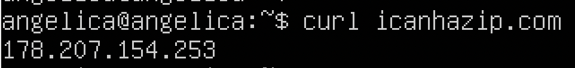
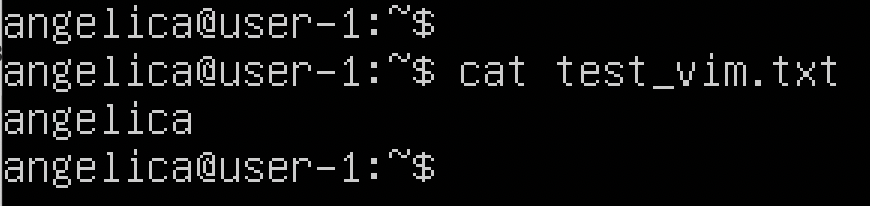
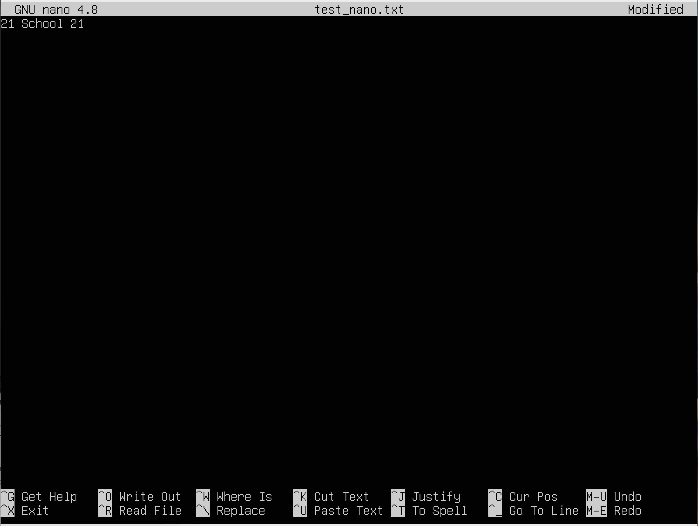
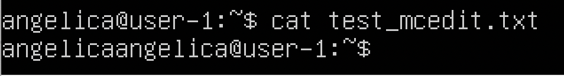
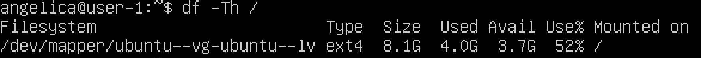

 ## Part 1. Установка ОС

**== Задание ==**
1. **Установить Ubuntu 20.04 Server LTS без графического интерфейса. (Используем программу для виртуализации - VirtualBox)**
    * Графический интерфейс должен отсутствовать.
    * Узнайте версию Ubuntu, выполнив команду ```cat /etc/issue```.
    * Вставьте скриншот с выводом команды.<br>

**== Решение ==**
 1. Установливаем Ubuntu 20.04 Server LTS без графического интерфейса, используя программу для виртуализации - VirtualBox.
    * Узнаем версию Ubuntu, выполнив команду ```cat /etc/issue```.
    * Скриншот с выводом команды:<br>
     
    <br>

## Part 2. Создание пользователя

**== Задание ==**
1. **Создать пользователя, отличного от пользователя, который создавался при установке. Пользователь должен быть добавлен в группу adm.**
    * Вставьте скриншот вызова команды для создания пользователя.
    * Новый пользователь должен быть в выводе команды ```cat /etc/passwd```
    * Вставьте скриншот с выводом команды.<br>

**== Решение ==**
1. Создали пользователя
    * Скриншот вызова команды для создания пользователя:<br>
    
   <br>
    
    * Скриншот с выводом команды ```cat /etc/passwd``` (имя нового пользователя отображается в последней строке):<br>
    
    <br>

## Part 3. Настройка сети ОС

**== Задание ==**

1. **Задать название машины вида user-1**

2. **Установить временную зону, соответствующую вашему текущему местоположению.**

3. **Вывести названия сетевых интерфейсов с помощью консольной команды.**
    * В отчёте дать объяснение наличию интерфейса lo.

4. **Используя консольную команду получить ip адрес устройства, на котором вы работаете, от DHCP сервера.**
    * В отчёте дать расшифровку DHCP.

5. **Определить и вывести на экран внешний ip-адрес шлюза (ip) и внутренний IP-адрес шлюза, он же ip-адрес по умолчанию (gw).**

6. **Задать статичные (заданные вручную, а не полученные от DHCP сервера) настройки ip, gw, dns (использовать публичный DNS серверы, например 1.1.1.1 или 8.8.8.8).**

7. **Перезагрузить виртуальную машину. Убедиться, что статичные сетевые настройки (ip, gw, dns) соответствуют заданным в предыдущем пункте.**
    * В отчёте опишите, что сделали для выполнения всех семи пунктов (можно как текстом, так и скриншотами).
    * Успешно пропинговать удаленные хосты 1.1.1.1 и ya.ru и вставить в отчёт скрин с выводом команды. В выводе команды должна быть фраза "0% packet loss".

**== Решение ==**

1. Задаем название машины user-1, используя команду ```sudo hostnamectl set-hostname user-1```:<br>
    
    <br>

2. Устанавливаем сетевую зону по местоположению с помощью команды ```sudo timedatectl set-timezone Europe/Moscow```:<br>
    
    <br>

    * Проверяем смену часового пояса с помощью команды ```timedatectl```:<br>
    
    <br>

3. Выводим названия сетевых интерфейсов с помощью команды ```ls /sys/class/net/```:<br>
    
    <br>

    * **lo (loopback device)** – виртуальный интерфейс, присутствующий по умолчанию в любом Linux. Он используется для отладки сетевых программ и запуска серверных приложений на локальной машине. С этим интерфейсом всегда связан адрес 127.0.0.1.
    <br>

4. С помощью команды ```ip address``` получаем ip адрес устройства, на котором работаем, от DHCP сервера:<br>
    
    <br>

    * **DHCP (англ. Dynamic Host Configuration Protocol** — протокол динамической настройки узла)** — сетевой протокол, позволяющий сетевым устройствам автоматически получать IP-адрес и другие параметры, необходимые для работы в сети TCP/IP. Данный протокол работает по модели «клиент-сервер». Для автоматической конфигурации компьютер-клиент на этапе конфигурации сетевого устройства обращается к так называемому серверу DHCP и получает от него нужные параметры. Сетевой администратор может задать диапазон адресов, распределяемых сервером среди компьютеров. Это позволяет избежать ручной настройки компьютеров сети и уменьшает количество ошибок. Протокол DHCP используется в большинстве сетей TCP/IP.
    <br>

5. Определяем внешний ip-адрес шлюза с помощью команды ```curl icanhazip.com```:<br>
    
    <br>

    * Определяем внутренний IP-адрес шлюза с помощью команды ```ip route | grep default```:
    
    

6. Редактируем файл под нужные настройки используя ```""
sudo vim /etc/netplan/00-installer-config.yaml```:<br>
    
    <br>

    * Сохраняем изменения командой ```sudo netplan apply```<br>
    <br>

7. Перезапускаем машину командой ```reboot```
     <br>
    * Пингуем командой ```hostname -I && ping -c 4 1.1.1.1 | grep "stat\|loss" && ping -c 4 ya.ru```. В выводе команды есть фраза "0% packet loss":<br>
    
    <br>

## Part 4. Обновление ОС

**== Задание ==**
1. **Обновить системные пакеты до последней на момент выполнения задания версии.**

**== Решение ==**

1. Выполняем команду ```sudo apt update``` для получения доступных пакетов:
    <br>
    * Обновляем системные пакеты до последней версии командой ```sudo apt full-upgrade```
    * Запускаем команду обновления ещё раз, появляется сообщение, что обновления отсутствуют:<br>
    
    <br>

## Part 5. Использование команды sudo

**== Задание ==**

1. **Разрешить пользователю, созданному в Part 2, выполнять команду sudo.**

**== Решение ==**

1. С помощью команды ```sudo usermod -aG sudo (имя пользователя)``` разрешаем пользователю использовать sudo: 
   * С помощью команды ```sudo usermod -aG sudo (имя пользователя)``` разрешаем пользователю использовать sudo
   * Устанавливаем пароль для созданного в Part 2 пользователя с помощью команды ```sudo passwd (имя пользователя)```
   * Чтобы сменить пользователя, нужно ввести команду ```su - (имя пользователя)``` 
   * Сменив пользователя, редактируем командой ```sudo vim /etc/hostname``` на наш логин
   * Командой ```hostnamectl``` проверяем результат:<br>
   * 
   * <br>
   * **sudo** - это утилита для операционных систем семейства Linux, позволяющая пользователю запускать программы с привилегиями другой учётной записи, как правило, суперпользователя. В части запуска команд от имени root’а sudo является альтернативой утилите su. Правда, в отличие от su, которая запускает оболочку root’а и предоставляет суперполномочия всем дальнейшим инструкциям, sudo предоставляет только временное повышение привилегий. Таким образом, включая полномочия root’а только когда это действительно необходимо, применение команды sudo снижает вероятность того, что опечатка или ошибка в вызываемой команде причинит какой-нибудь вред системе.
    <br>

## Part 6. Установка и настройка службы времени

**== Задание ==**

1. **Настроить службу автоматической синхронизации времени.**

**== Решение ==**

1. С помощью команды ```timedatectl show``` выводим время часового пояса, в котором сейчас находимся:<br>
    
    <br>
  

## Part 7. Установка и использование текстовых редакторов

**== Задание ==**

1. **Установить текстовые редакторы VIM (+ любые два по желанию NANO, MCEDIT, JOE и т.д.)**

2. **Используя каждый из трех выбранных редакторов, создайте файл test_X.txt, где X -- название редактора, в котором создан файл. Напишите в нём свой никнейм, закройте файл с сохранением изменений.**
    * В отчёт вставьте скриншоты:
        Из каждого редактора с содержимым файла перед закрытием.
    * В отчёте укажите, что сделали для выхода с сохранением изменений.


3. **Используя каждый из трех выбранных редакторов, откройте файл на редактирование, отредактируйте файл, заменив никнейм на строку "21 School 21", закройте файл без сохранения изменений.**
    * В отчёт вставьте скриншоты:
        Из каждого редактора с содержимым файла после редактирования.
    * В отчёте укажите, что сделали для выхода без сохранения изменений.


4. **Используя каждый из трех выбранных редакторов, отредактируйте файл ещё раз (по аналогии с предыдущим пунктом), а затем освойте функции поиска по содержимому файла (слово) и замены слова на любое другое.**
    * В отчёт вставьте скриншоты:
        Из каждого редактора с результатами поиска слова.
    * Из каждого редактора с командами, введёнными для замены слова на другое.

**== Решение ==**

1. VIM и NANO уже установлены, используя команду ```sudo apt install mcedit```, устанавливаем текстовый редактор mcedit
<br>

2. Решение:
    **VIM**
    * Создаем файл с помощью команды ```vim test_vim.txt```
    * Нажимаем "i" для перехода в режим редактирования
    * Пишем ник: "angelica":<br>
    
    <br>
    * Для выхода с сохранением нажимем 'Esc' вводим команду ':wq' и нажимаем 'Enter'
    * Проверяем файл с помощью команды ```cat test_vim.txt```:
    
    
    <br>

    **NANO**
    * Создаем файл с помощью команды ```nano test_nano.txt```
    * Пишем ник: "angelica":<br>
    
    <br>
    * Для выхода нажимаем комбинацию 'ctrl+x' для сохранения вводим 'Y' и нажимаем'Enter'
    * Проверяем файл с помощью команды ```cat test_nano.txt```:
    
    
    <br>

    **MCEDIT**
    * Cоздаем файл с помощью команды ```mcedit test_mcedit.txt```
    * Пишем ник: "angelica":<br>
    
    <br>
    * Для выхода с сохранением нажимаем 'Esc', а затем клавишу 'YES' или 'Да'
    * Проверяем файл с помощью команды ```cat test_mcedit.txt```:
    
    
    <br>
  
3. Решение
    **VIM**
    * Открываем файл с помощью команды ```vim test_vim.txt```
    * Нажимаем "i" для перехода в режим редактирования
    * Изменяем ник на "21 School 21"
    * Для выхода без сохранения нажимаем 'Esc' вводим команду ':q!' и нажимаем 'Enter':
    
    
    <br>
    * Проверяем файл с помощью команды ```cat test_vim.txt```:
    
    
    

    **NANO**
    * Открываем файл с помощью команды ```nano test_nano.txt```
    * Изменяем ник на "21 School 21":
    * 
    
    
    * Для выхода без сохранения нажимаем комбинацию 'ctrl+x', потом 'N'
    * Проверяем файл с помощью команды ```cat test_nano.txt```:
    
    
   
  
    **MCEDIT**
    * Открываем файл с помощью команды ```mcedit test_mcedit.txt```
    * Изменяем ник на "21 School 21":<br>
    
    <br>
    * Для выхода без сохранения нажимаем 'Esc', а затем 'No'
    * Проверяем файл с помощью команды ```cat test_mcedit.txt```:
    
    
    <br>

4. Решение
    **VIM**
    * Открываем файл с помощью команды ```vim test_vim.txt```
    * Для поиска в VIM вводим ```/angelica``` и искомое слово выделяется в самом редакторе:<br>
    
    
    <br>
    * Для замены слова в VIM вводим ```:%s/angelica/21 School 21``` и слово "angelica" заменяется на "21 School 21":<br>
    
    
    <br>
    * Проверяем файл с помощью команды 'cat test_vim.txt':<br>
    
    
    <br>
  
    **NANO**
    * Открываем файл с помощью команды ```nano test_nano.txt```
    * Для поиска в NANO вводим 'ctrl + W' и нажимаем 'Enter':<br>
    
    <br>
    * Для замены слова в NANO вводим 'ctrl + \', пишем "angelica", нажимаем 'Enter', пишем "21 School 21", нажимаем 'Enter', выбираем 'Y':
    
    
    <br>
    * Проверяем файл с помощью команды ```cat test_nano.txt```:
    
    
    <br>

    **MCEDIT**
    * Открываем файл с помощью команды ```mcedit test_mcedit.txt```
    * Для поиска в mcedit вводим Shift + 'F7', затем вводим слово 'angelica', выбираем "Найти всё", слово выделяется зеленым:
    
    
    
    * Для замены слова в mcedit жмем Shift + 'F4', затем вводим "angelica", нажимаем стрелку вниз, пишем "21 School 21", нажимаем "Дальше" и выбираем "Заменить":
    
    
    
    * Проверяем файл с помощью команды ```cat test_mcedit.txt```:
    
    
    

## Part 8. Установка и базовая настройка сервиса SSHD

**== Задание ==**

1. **Установить службу SSHd.**
2. **Добавить автостарт службы при загрузке системы.**
3. **Перенастроить службу SSHd на порт 2022.**
4. **Используя команду ps, показать наличие процесса sshd. Для этого к команде нужно подобрать ключи.**
    * В отчёте объяснить значение команды и каждого ключа в ней.
5. Перезагрузить систему.
    * В отчёте опишите, что сделали для выполнения всех пяти пунктов (можно как текстом, так и скриншотами).
    * Вывод команды netstat -tan должен содержать 
        tcp 0 0 0.0.0.0:2022 0.0.0.0:* LISTEN  
        (если команды netstat нет, то ее нужно установить)
    * Скрин с выводом команды вставить в отчёт.
    * В отчёте объяснить значение ключей -tan, значение каждого столбца вывода, значение 0.0.0.0.

**== Решение ==**

1. Устанавливаем службу SSHd командой ```sudo apt install openssh-server```
    * Проверяем наличие командой ```ssh -V```:<br>
    
    <br>

2. Добавляем автостарт службы SSHd командой ```sudo systemctl enable ssh.service```
<br>

3. Открываем config ```sudo vim /etc/ssh/sshd_config```
    * Изменяем порт SSHd: добавляем строку 'Port 2022' после строки '#Port 22':<br>
    
    <br>
    * Используем команду ```/etc/init.d/ssh restart``` для того что бы изменения вступили в силу:
    
    
    <br>

4. Используем команду ```ps -axfv | grep sshd``` для проверки наличия процесса:<br>
    
    <br>
    * Команда 'ps' показывает текущие процессы на сервере. 
    * Команда 'grep' позволяет выдилить нужную нам информацию по процессам
    * **флаг -a** оставляет все процессы, кроме лидеров сеансов и процессов, не связанных с терминалом
    * **флаг -x** заставляет 'ps' отображать список всех процессов, которыми вы владеете
    * **флаг -f** выводит полноформатный список
    * **флаг -v** выводит информацию о версии
    <br>

5. Устанавливаем *net-tools* ```sudo apt install net-tools```
    * Выполняем команду ```netstat -tan```. Вывод команды netstat -tan содержит ```tcp 0 0 0.0.0.0:2022 0.0.0.0:* LISTEN```:<br>
    
    <br>
    * Перезагружаем систему командой ```sudo reboot```
    <br>
    * -a показывает состояние всех сокетов
    * -n показывает ip адрес, а не сетевое имя
    * -t показывает только tcp соединения
    * стобец Proto - протокол, используемый сокетом
    * стобец Recv-Q - количество байтов, не скопированных пользовательской программой, подключенной к этому сокету
    * стобец Local Adbress - локальный адрес (имя локального хоста) и номер порта сокета
    * стобец Foreign Adbress - удаленный адрес (имя удаленного хоста) и номер порта сокета
    * стобец State - состояние сокета
    * 0.0.0.0 в выводе netstat означает, что ssh daemon прослушивает все интерфейсы IPv4, которые есть у машины
    <br>


## Part 9. Установка и использование утилит top, htop

**== Задание ==**
1.  **Установить и запустить утилиты top и htop.**
    * По выводу команды top определить и написать в отчёте:
        * uptime
        * количество авторизованных пользователей
        * общую загрузку системы
        * общее количество процессов
        * загрузку cpu
        * загрузку памяти
        * pid процесса занимающего больше всего памяти
        * pid процесса, занимающего больше всего процессорного времени

    * В отчёт вставить скрин с выводом команды htop:
        * отсортированному по PID, PERCENT_CPU, PERCENT_MEM, TIME
        * отфильтрованному для процесса sshd
        * с процессом syslog, найденным, используя поиск
        * с добавленным выводом hostname, clock и uptime

**== Решение ==**

1. Командой ```top``` запускаем соответствующую утилиту:
    
    <br>
    * пояснения 
        * uptime - up 2 min 
        * количество авторизированных пользователей - 1 user 
        * общая загрузка системы - load average 0.00, 0.00, 0.00 
        * общее количество процессов - Tasks 97 total 
        * загрузка cpu - 0.0 us, 0.3 sy, 0.0 ni, 99.7 id, 0.0 wa, 0.0 hi, 0.0 si, 0.0 st
        * загрузка памяти - MiB Mem (965.1 total, 193.4 free, 154.4 used, 617.3 buff/cache) и Mib Swap(файл подкачки) (1481.0 total, 1476.5 free, 4.5 used, 656.3 avail Mem)
        * pid процесса, занимающего больше всего памяти - 1 root 
        * pid процесса, занимающего больше всего процессорного времени - 1 root
    <br>
    * Жмем 'q' для выхода из top
    <br>   
    * Командой ```htop``` запускаем утилиту:
    
    
    <br>
    
    * Для выбора того как проводить сортировку мы нажимаем 'F6'
        * PID:<br>
        
        <br>
        
        * PERCENT_CPU: <br>
        
        <br>
        
        * PERCENT_MEM: <br>
        
        <br>
        
        * TIME: <br>
        
        <br>
  
    * Для работы с фильтром нажимаем Fn + 'F4'
    * После мы вводим ```SShd``` и нажимаем 'Enter'
    * фильтр по SSHd:<br>
    
    <br>
    
    * Чтобы отменить работу с фильтром, нажимаем 'F4', после нажимаем 'Esc'
    * Для работы с поиском нажимаем Fn + 'F3'
    * После мы вводим ```syslog``` и нажимаем 'Enter'
    * Результат поиска:<br>
    
    <br>
    
    * Для добавления вывода hostname, clock и uptime нажимаем Fn + 'F2' и добавляем hostname, clock и uptime:<br>
    
    <br>

    * Выход Fn + 'F10'

## Part 10. Использование утилиты fdisk

**== Задание ==**

1. **Запустить команду ```fdisk -l```**

**== Решение ==**

1. Запуск утилиты командой ```sudo fdisk -l```
    * Название жесткого диска: VBOX HARDDISK, размер 10 GiB, количество секторов  20971520:<br>
    
    <br>

    * Используем команду ```free -h``` для определения размера swap
    * Размер swap: 1,4 Gi:<br>
    
    <br>

## Part 11. Использование утилиты df

**== Задание ==**

1. **Запустить команду df.**
    * В отчёте написать для корневого раздела (/):
        * размер раздела
        * размер занятого пространства
        * размер свободного пространства
        * процент использования
    * Определить и написать в отчёт единицу измерения в выводе.

2. **Запустить команду df -Th.**
    * В отчёте написать для корневого раздела (/):
        * размер раздела
        * размер занятого пространства
        * размер свободного пространства
        * процент использования
    * Определить и написать в отчёт тип файловой системы для раздела.

**== Решение ==**

1. Используем команду ```df /```:<br>
    
    <br>
    * Единица измерения в выводе: Килобайты

2. Используем команду ```df -Th /```:
    
    
    <br>
    
    * **'T, --print-type'** - Выдавать тип для каждой файловой системы. Тип берётся от операционной системы (и определяется системно-зависимым способом, например посредством чтения файла /etc/mtab)   
    * **'H, --si '** - Отобразит размер в человеко-читаемом формате, в единицах СИ, размерностью 1000, добавив названия единиц (Kилобайт, Mегабайт, Гигабайт, Tерабайт)
    * размер разделов: 8.1G
    * тип файловой системы раздела: ext4

## Part 12. Использование утилиты du

**== Задание ==**

1. **Запустить команду du.**
2. **Вывести размер папок /home, /var, /var/log (в байтах, в человекочитаемом виде)**
3. **Вывести размер всего содержимого в /var/log (не общее, а каждого вложенного элемента, используя *)**
    * В отчёт вставить скрины с выводом всех использованных команд.

**== Решение ==**

1. Запуcкаем команду ```du```:<br>
    
    <br>

2. С помощью команды ```sudo du -s -h /home```, ```sudo du -s -h /var```, ```sudo du -s -h /var/log``` выводим размер папок:<br>
    
    <br>

3. Выводим размер элементов ```/var/log *``` с помощью команды ```sudo du -sh /var/log/*```:<br>
    
    <br>
  

## Part 13. Установка и использование утилиты ncdu

**== Задание ==**

1. **Установить утилиту ncdu.**
2. **Вывести размер папок /home, /var, /var/log.**
    * Размеры должны примерно совпадать с полученными в Part 12.
    * В отчёт вставить скрины с выводом использованных команд.

**== Решение ==**

1. Командой ```sudo apt install ncdu``` устанавливаем ncdu
<br>

2. Выводим размер папок с помощью команды:
    * ```sudo ncdu /home```:<br>
    
    <br>
    
    * ```sudo ncdu /var```:<br>
    
    <br>
    
    * ```sudo ncdu /var/log```:<br>
    
    <br>

## Part 14. Работа с системными журналами

**== Задание ==**

1. **Открыть для просмотра:**
    1. /var/log/dmesg
    2. /var/log/syslog
    3. /var/log/auth.log 
    <br>
    * Написать в отчёте время последней успешной авторизации, имя пользователя и метод входа в систему.
    * Перезапустить службу SSHd.
    * Вставить в отчёт скрин с сообщением о рестарте службы (искать в логах).

**== Решение ==**

1. Решение:
    * Просмотр ```vim /var/log/dmesg```:<br>
        
        <br>

    * Просмотр ```vim /var/log/syslog```:<br>
        
        <br>

    * Просмотр ```vim /var/log/auth.log```:<br>
        
        <br>

    * Для просмотра последней авторизации, имени пользователя и метода входа в систему используем команду ```last```:<br>
        
        <br>

        * Время авторизации Tue Oct 31 16:25
        * Имя пользователя angelica
        * Метод входа в систему tty1
        * Командой ```service sshd restart``` перезапускаем службу SSHd:<br>

        
        <br>

    * Командой ```sudo cat /var/log/syslog``` выводим сообщение о рестарте служб:<br>
        
        <br>


## Part 15. Использование планировщика заданий CRON

**== Задание ==**

1. **Используя планировщик заданий, запустите команду uptime через каждые 2 минуты**

**== Решение ==**

1. Используем команду ```sudo apt install cron``` для установки **CRON**
    * Планируем задачу командой ```crontab -e```
    * В vim приписываем ```*/2 * * * * uptime```:<br>
    
    <br>
    
    * Командой ```crontab -l``` выводим список установленых задач:<br>
    
    <br>
    
    * Командой ```cat /var/log/syslog``` выводим список системных задач и видим, что через каждые 2 минуты CRON выводит логи:<br>
    
    <br>

    * Командой ```crontab -r``` удаляем все запланированые задачи
    * Проверяем список задач ещё раз Командой ```crontab -l```:<br>
    
    <br>
