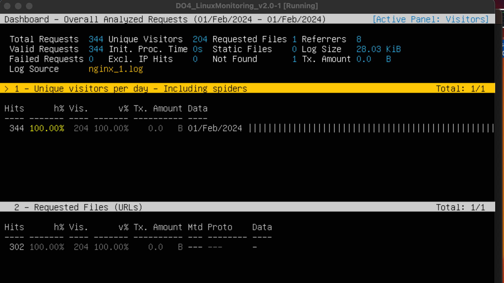
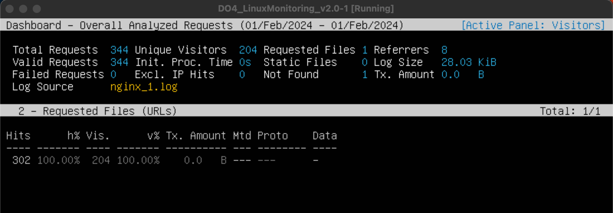
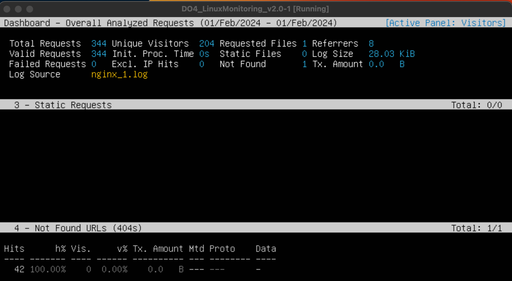
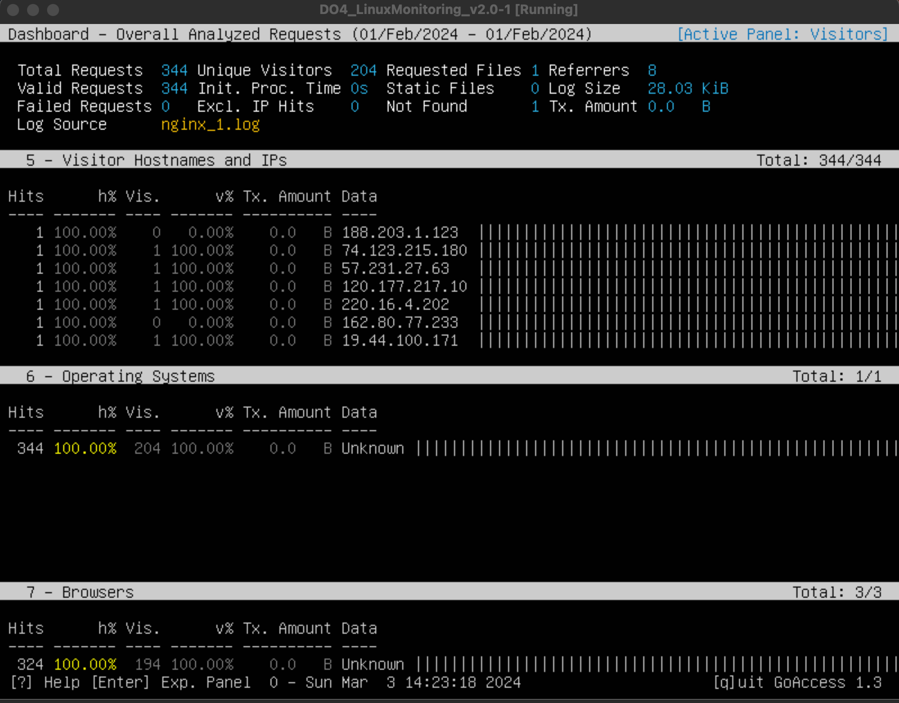
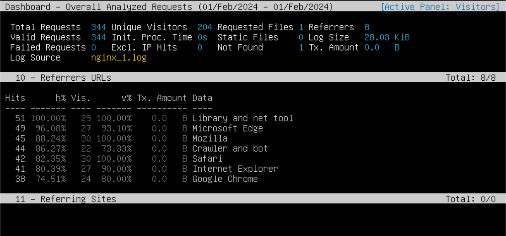
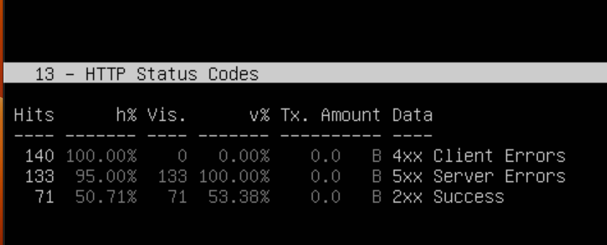
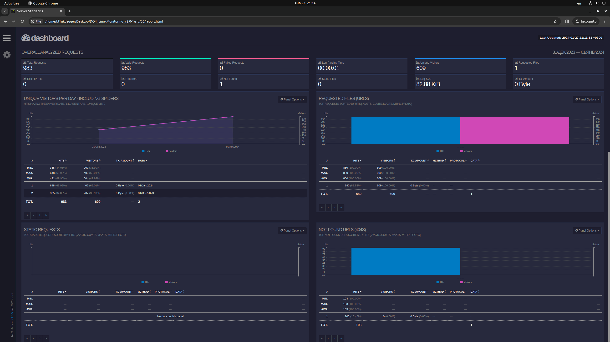

# LinuxMonitoring v2.0

Мониторинг и исследование состояния системы в реальном времени.

## Part 6. **GoAccess**

Смотреть на результаты трудов в консоли конечно неплохо, но почему бы дополнительно не воспользоваться готовым решением, предоставляющим удобный интерфейс?

**== Задание ==**

С помощью утилиты GoAccess получить ту же информацию, что и в [Части 5](#part-5-мониторинг)

#### 1. Visitors:



#### 2. Requests:



#### 3. Static_Requests, 4. Not found URLs:



#### 5. Visitor Hostnames and IPs, 6. Operating Systems, 7. Browsers:



#### 8. Time Distribution, 11. Referring Sites, 13. HTTP Status Codes:




Открыть веб интерфейс утилиты на локальной машине.



```
файл report.html находится в той же папке, где и отчёт
```
