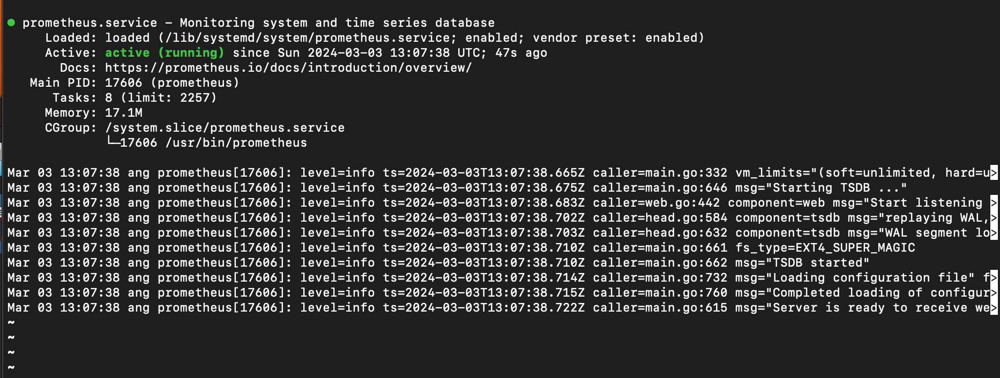
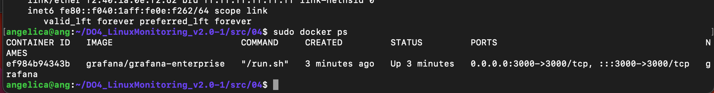
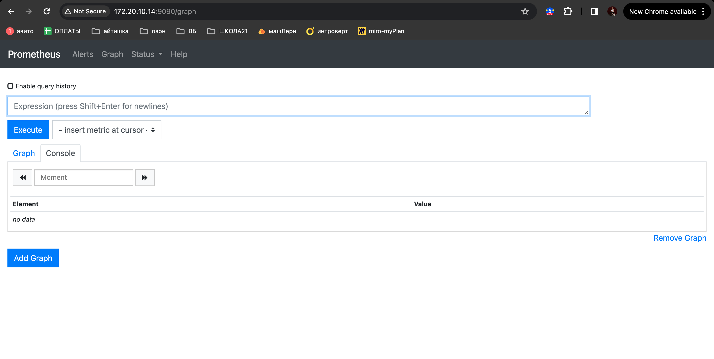
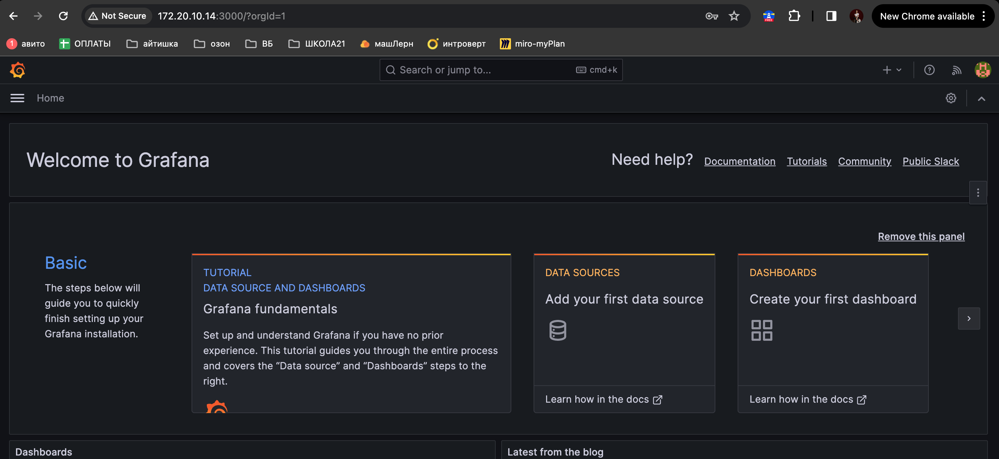
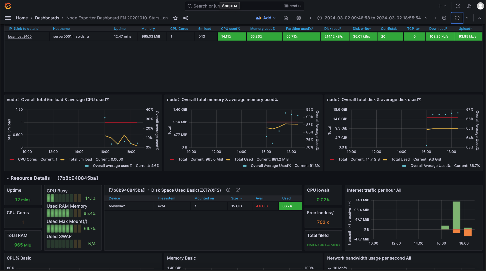
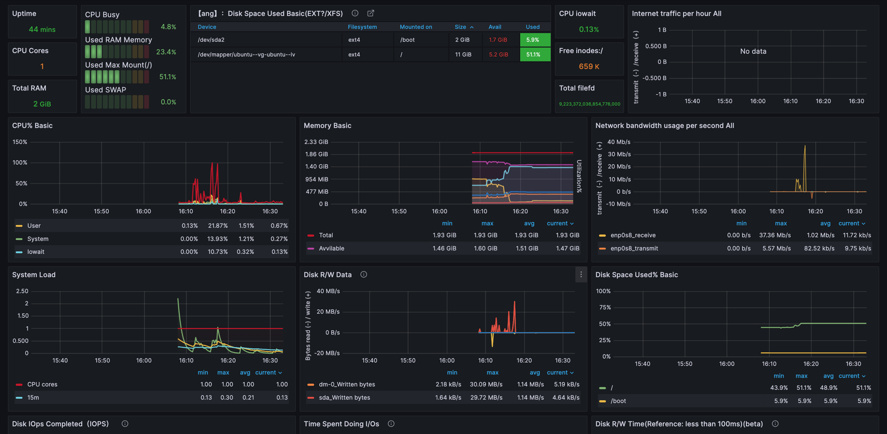
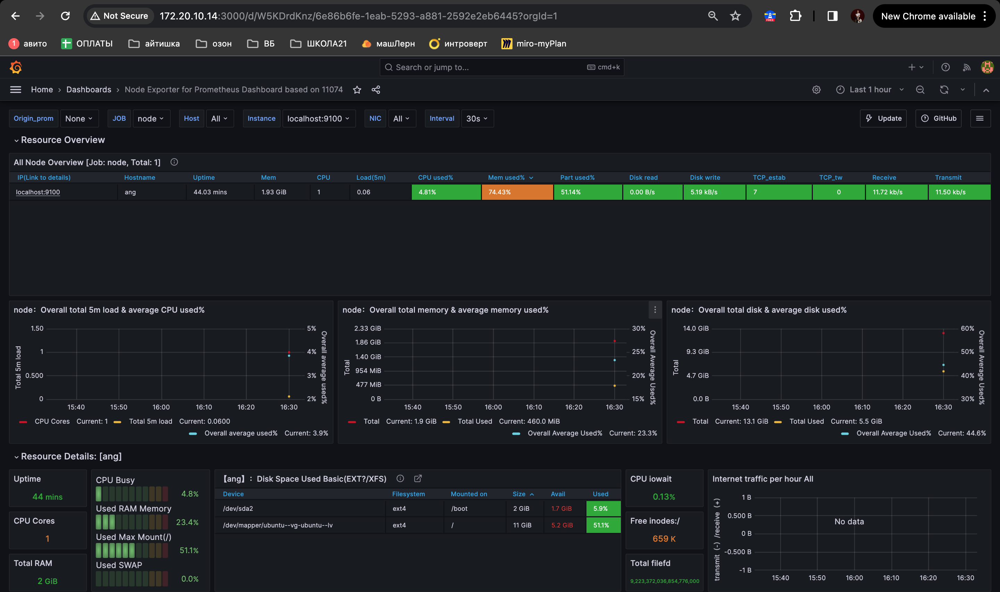
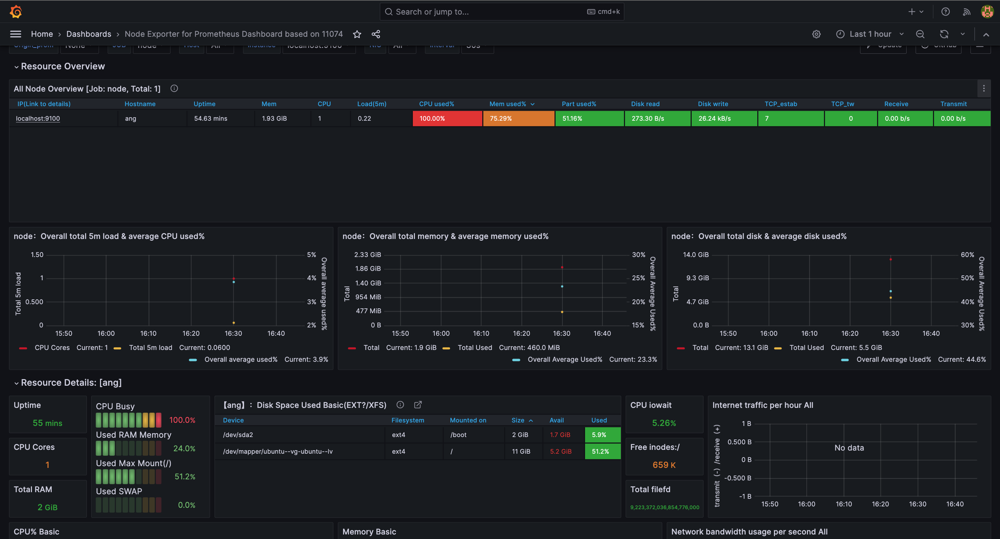
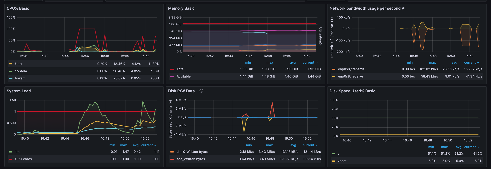

# LinuxMonitoring v2.0

Мониторинг и исследование состояния системы в реальном времени.

## Part 7. **Prometheus** и **Grafana**

Практика с логами пока что окончена. Теперь пришло время мониторить состояние системы в целом.

**== Задание ==**

##### Установить и настроить **Prometheus** и **Grafana** на виртуальную машину

*Prometheus:*

*Node Exporter* / *Grafana:*

##### Получить доступ к веб интерфейсам **Prometheus** и **Grafana** с локальной машины

*Prometheus:*

*Grafana:*

##### Добавить на дашборд **Grafana** отображение ЦПУ, доступной оперативной памяти, свободное место и кол-во операций ввода/вывода на жестком диске

##### Запустить ваш bash-скрипт из [Части 2](#part-2-засорение-файловой-системы)
##### Посмотреть на нагрузку жесткого диска (место на диске и операции чтения/записи)

##### Установить утилиту **stress** и запустить команду `stress -c 2 -i 1 -m 1 --vm-bytes 32M -t 10s`

##### Посмотреть на нагрузку жесткого диска, оперативной памяти и ЦПУ

##### Запусти ещё одну виртуальную машину, находящуюся в одной сети с текущей.
##### Запусти тест нагрузки сети с помощью утилиты **iperf3**.

##### Посмотри на нагрузку сетевого интерфейса.

