## Part 1. Готовый докер

<pre>1.1 Установим приложение Docker для дальнейшей работы с докером. Тк версия MacOs 10.15.7 (очень старенькая), то через консоль это сделать невозможно, выкачиваем через браузер (Docker version 20.10.21). </pre>

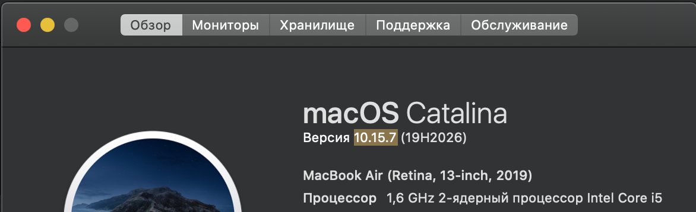 *Рисунок 1.1  Версия MacOs*
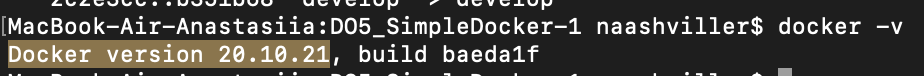 *Рисунок 1.1.0  Версия Docker*

<pre>1.2 Берем официальный докер образ с nginx и выкачиваем его при помощи docker pull</pre>

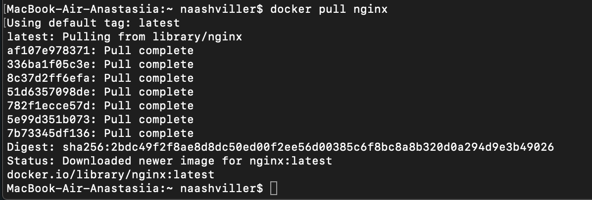 *Рисунок 1.2  Скачивание докер образа с nginx*

<pre>1.3 Проверим наличие докер образа через docker images</pre>

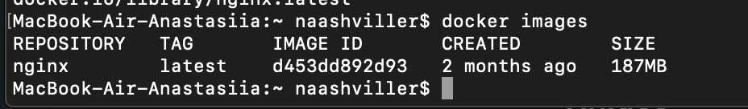 *Рисунок 1.3  Проверка на наличие докер образа*

<pre>1.4 Запустим докер образ через docker run -d [image_id|repository]</pre>

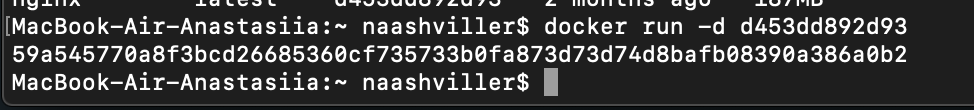 *Рисунок 1.4  Запуск докер образа*

<pre>1.5 Проверим, что образ запустился через docker ps</pre>

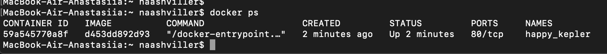 *Рисунок 1.5  Проверка запуска докер образа*

<pre>1.6 Посмотрим информацию о контейнере через docker inspect [container_id|container_name]</pre>

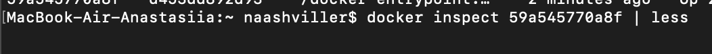 *Рисунок 1.6.1  Выполнение команды для просмотра информации о контейнере*
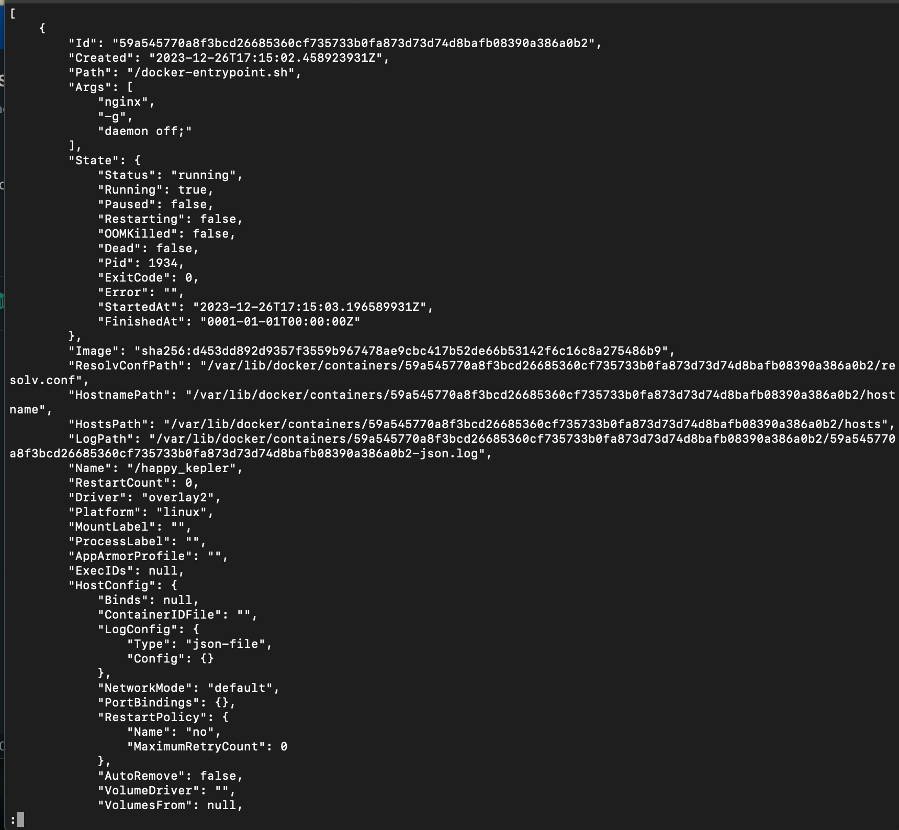 *Рисунок 1.6.2  Просмотр информации о контейнере*

<pre>1.7 По выводу команды определим и поместим в отчёт размер контейнера, список замапленных портов и ip контейнера</pre>

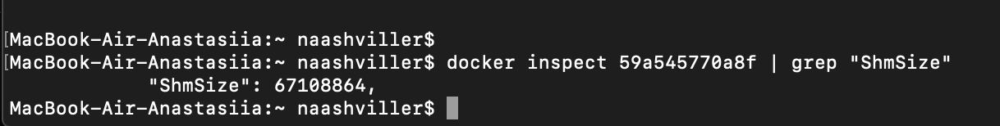 *Рисунок 1.7.1  Размер контейнера*

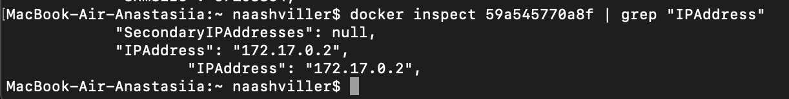 *Рисунок 1.7.2  IP контейнера*

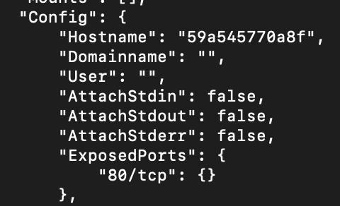 *Рисунок 1.7.3  Список замапленных портов*

<pre>1.8 Остановим докер образ через docker stop [container_id|container_name]
    Проверим, что образ остановился через docker ps</pre>

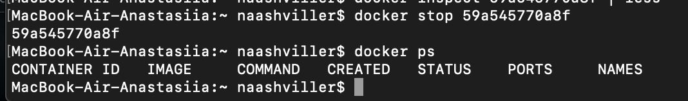 *Рисунок 1.8  Остановка и проверка остановки докер образа*

<pre>1.9 Запустим докер с портами 80 и 443 в контейнере, замапленными на такие же порты на локальной машине, через команду run</pre>

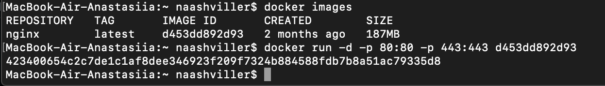 *Рисунок 1.9  Запуск докер образа с портами 80 и 443 в контейнере*

<pre>1.10 Проверим, что в браузере по адресу localhost:80 доступна стартовая страница nginx</pre>

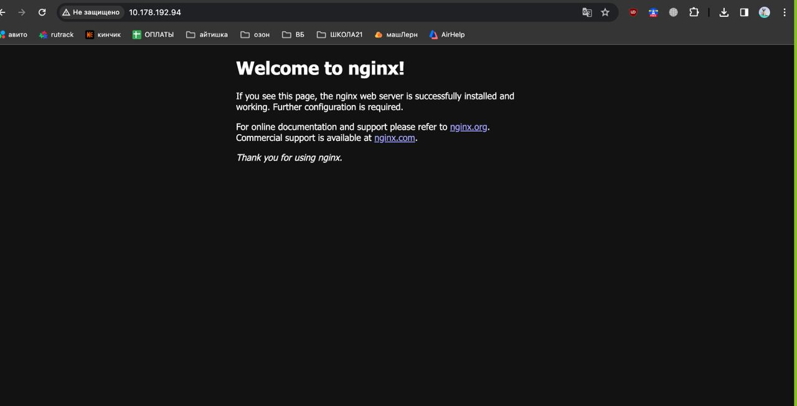 *Рисунок 1.10  Проверка доступа к стартовой странице nginx*

<pre>1.11 Перезапустим докер контейнер через docker restart [container_id|container_name]
     Проверим любым способом, что контейнер запустился</pre>

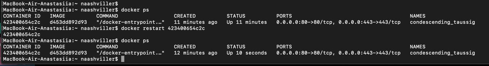 *Рисунок 1.11  Перезапуск и проверка перезапуска докер контейнера*

## Part 2. Операции с контейнером

<pre>2.1 Прочитаем конфигурационный файл nginx.conf внутри докер контейнера через команду exec</pre>

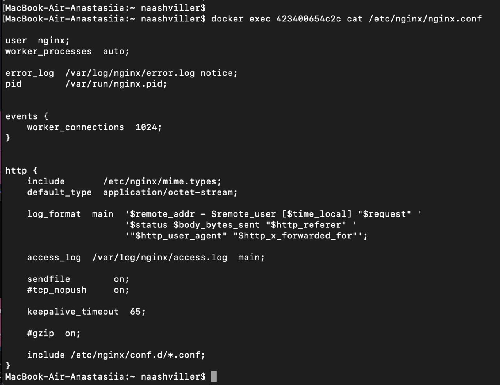 *Рисунок 2.1  Конфигурационный файл nginx.conf внутри докер контейнера*

<pre>2.2 Создадим на локальной машине файл nginx.conf
    Настроим в нем по пути /status отдачу страницы статуса сервера nginx</pre>

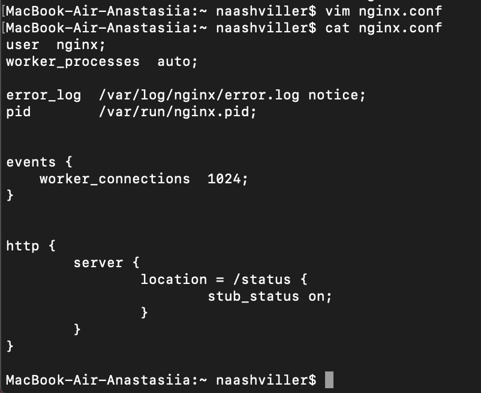 *Рисунок 2.2  Файл nginx.conf с настройкой в нем по пути /status*

<pre>2.3 Скопируем созданный файл nginx.conf внутрь докер образа через команду docker cp</pre>

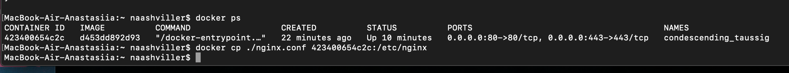 *Рисунок 2.3  Копирование файла nginx.conf внутрь докер образа*

<pre>2.4 Перезапустим nginx внутри докер образа через команду exec</pre>

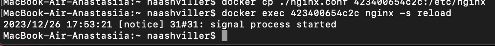 *Рисунок 2.4  Перезапуск nginx внутри докер образа*

<pre>2.5 Проверим, что по адресу localhost:80/status отдается страничка со статусом сервера nginx</pre>

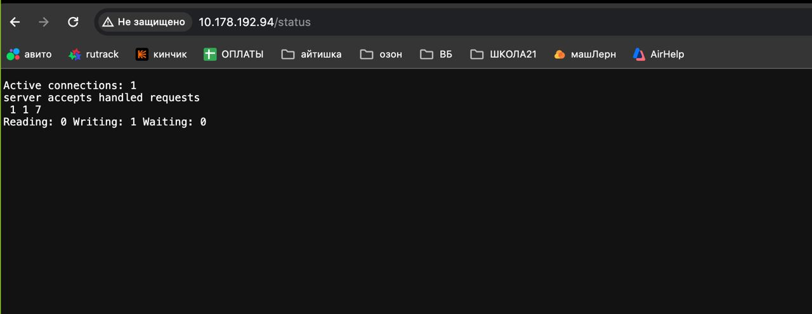  *Рисунок 2.5  Страница по адресу localhost:80/status*

<pre>2.6 Экспортируем контейнер в файл container.tar через команду export</pre>

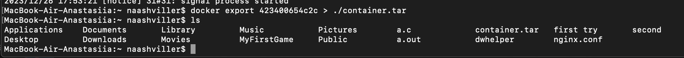 *Рисунок 2.6  Экспорт контейнера в файл container.tar*

<pre>2.7 Остановим контейнер</pre>

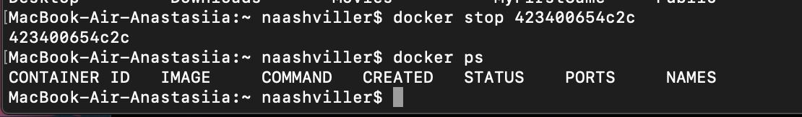 *Рисунок 2.7  Остановка контейнера*

<pre>2.8 Удалим образ через docker rmi [image_id|repository], не удаляя перед этим контейнеры</pre>

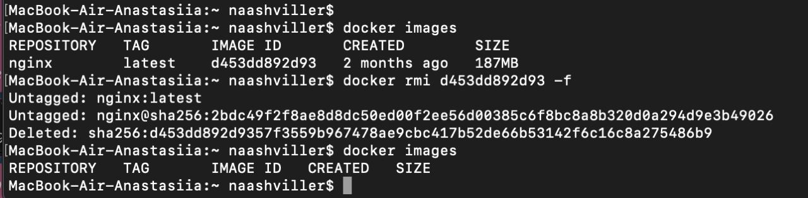 *Рисунок 2.8  Удаление образа*

<pre>2.9 Удалим остановленный контейнер</pre>

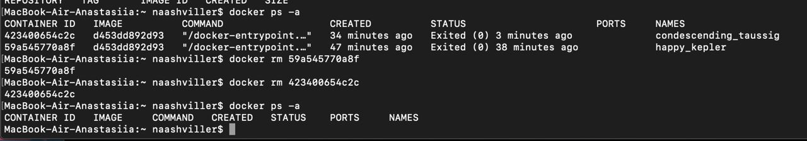 *Рисунок 2.9  Удаление контейнера*

<pre>2.10 Импортируем контейнер обратно через команду import
     Запустим импортированный контейнер</pre>

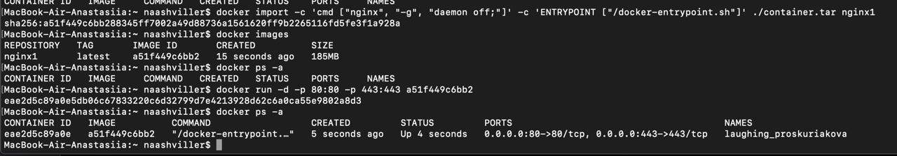 *Рисунок 2.10  Импорт и запуск импортированного контейнера*

<pre>2.11 Проверим, что по адресу localhost:80/status отдается страничка со статусом сервера nginx</pre>

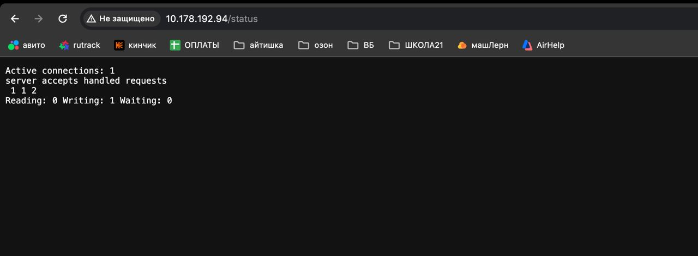 *Рисунок 2.11  Страница по адресу localhost:80/status*